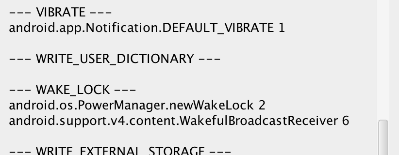

# AndroidPermissionsUsage

*Note: this is an experiment and it doesn't do perfectly what it's supposed to do*

AndroidPermissionsUsage is an IntelliJ IDEA (and Android Studio) plugin designed to find the usage of the permissions defined in an Android application.

It happens often that a lot of permissions get defined in the `AndroidManifest.xml` and never get actually used anywhere in the app. Sometimes a functionality gets modified or removed and the initially required permission stays there because everyone forgot about it.

As a result you might enter the permissions nightmare and your users would start to freak out about their rights.

(Although I'm pretty sure these were declared on purpose)

There is currently no way to check which permissions are used or not by your app. Hopefully Google might integrate a solution in Lint in the future. But for now, let's try something else...

## How does this plugin work?

AndroidPermissionsUsage is based on a simple mechanism: the "Find usage..." functionality. When asked for it, this plugin will:
1. Grab the permissions declared in the `AndroidManifest.xml`
2. For each permission, look through the Android SDK and find the methods/classes/fields that contain a reference to the permission in its javadoc
3. Look through your project modules and libraries (if the sources are available) and count the references for each method/class/field requiring a permission
4. Finally display a window listing all permission and the methods/classes/fields that you use in your project (as well as the number of times you use each of them

## But does it actually work?!

As you may imagine, I was quite excited when I originally got this idea. At the end the plugin kinda work and it's not too slow (~4s for a big project).
But it's mainly limited by the Android documentation. Some permissions are not specified as required in the javadoc even if they if they need to be declared in the manifest. For example the permission `android.permission.INTERNET` is not mentioned a lot and it can show as not used even though your app will need it. Another example is the permission `android.permission.READ_CALENDAR` which is not even mentioned in the Android SDK javadoc for any classes requiring it.
Another limitation is that the javadoc is showing references to permissions on the build versions (`DONUT`, `ICE_CREAM_SANDWICH`...) because they have somehow been changed at that point. As a result, the references will show in the final summary.

So, well, it doesn't really work but at least it was interesting. I'm leaving this as a note for those who might be interested in the problem.

# How to install it?

I'm glad you asked.
Download the [latest archive](https://github.com/RomainPiel/AndroidPermissionsUsage/AndroidFindPermissions.jar).
In IntelliJ or Android Studio, open the preferences.
- Go to `Plugins > Install plugin from disk`
- Pick the downloaded archive
- Restart the IDE as requested
- Right click on your `AndroidManifest.xml`
- Click on `Find Permissions Usage...`
- After a few seconds, you should see a popup with the results